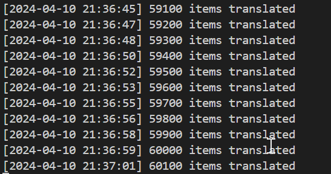

# RPGMakerTrans

RPGMakerTrans is a fork of the abandoned project [rpgmakertrans](https://bitbucket.org/rpgmakertrans/rpgmakertrans/src/master/). This project focuses on the CLI version of RPGMakerTrans and provides an easy way to run or build applications from source code. It addresses the outdated Python version requirements and dependencies used in the original application.

## Improvements and Changes

- All previously uneditable texts, such as map names, event names, and comments, are now editable. This allows developers to include texts that are not normally viewable in-game.
- Event labels are no longer translatable, as translating them would cause more harm than benefits.
- Ruby scripts (RGSS Scripts) are included literally.
- Multi-lined texts in some area are properly translated as multi-line texts (it was concatenate into a single line in the original build).
- Several problems from the previous version of RPGMakerTrans have been fixed.
- The progress now accurately reflects the activity of the process. (Because people complains a lot on how the progress bar seems to be stuck at around 90% or so)



## How to Run

To run RPGMakerTrans, follow these steps:

1. Clone this repo somewhere in your computer
2. Open a command prompt.
2. Navigate to the `rpgmakertrans` directory within your local clone of the repo.
3. Run the following command:
```shell
cd rpgmakertrans
..\python3.4\python.exe .\rpgmt.py path\to\your\rpgmaker\game
```

## CLI Command Documentation

The RPGMakerTrans CLI provides several command-line options for running the tool. Here is a description of each option:

- `input`: Specifies the path of the input game to patch. This is a required argument.

- `-p, --patch`: Specifies the path of the patch (directory or zip) to apply. If not provided, the default path is `input_directory_patch`.

- `-o, --output`: Specifies the path to the output directory where the translated game will be saved. If not provided, the default path is `input_directory_translated`.

- `-q, --quiet`: Suppresses all output from the CLI tool.

- `-b, --use-bom`: Uses UTF-8 BOM in patch files.

- `-r, --rebuild`: Rebuilds the patch against the game.

- `-s, --socket`: Specifies the socket to use for XP/VX/VX Ace patching. The default socket is `27899`.

- `-l, --dump-labels`: Dumps labels to the patch file.

- `--dump-scripts`: Dumps scripts to the specified directory.

- `-n, --maxline`: Maximum number of line in a dialog box. Default is 4.